# Introduction

For my web scraping project, I've chosen to extract some of the
politics data from craigslist.org. My original ambition, though it
proved difficult to affirm, was to prove a small, non-existant, or
negative correllation of pro-trump chatter to expected
conservatism. That is, I suspected that, somewhat counter-intuitively,
the politics sections of more conservative states would a
disproportionately less likely source of pro-trump posts. My basis for
this suspicion was my general observation that less regulated areas
for discussion on the internet tend to be very attractive to those
members of a publically socially disparaged minority. Recognizing
that, among other clues, Trump supporters in largely pro-Clinton
geographic areas are disparaged for their support in amounts
disproportionate to their surprisingly high representation, it
followed that I could expect a surprising amount of pro-Trump (mostly
trollish) chatter in mostly liberal places (e.g., New York City). The
positive sentiment aspect of that hypothesis proved to be difficult to
convincingly affirm. More generally, also I sought to analyze the
trends of politcs discussion of craiglist, mostly in the area of text
usage (capitalization, word frequency, etc) vs political leaning.

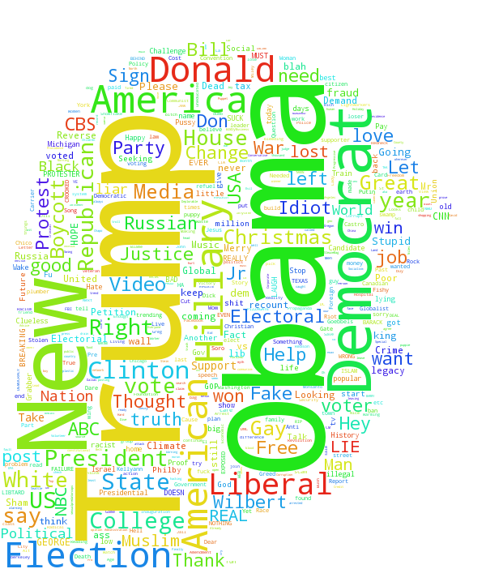

# Methodology

To extract data from craigslist, I used the Python Scrapy package,
which was probably overkill. Originally, I intended to collect post
bodies as well as the titles, however this would require about 100
times as many request, too many for me to reponsibly exectute in a
reasonable amount of time. I resigned to limiting myself to titles,
which involved about 500 requests, spread over 5 hours, to obtain
roughly 40,000 posts titles/times. For each of these titles, there is
a corresponding state and region, with some regions additionally
divided into subregions (the New York City region, for example,
consists of Brooklyn, Queens, Manhattan, etc). Each post, its time and
its geographical origin are represented with a single row in a 40k row
Pandas DataFrame, `usa`. Data corruption was not an issue, as the CL
layout is quite uniform, though I did need to take into account data
redundancy (e.g., occaisionally "regions" are also "subregions" of
sibling regions). To make use of the extracted post title data, I
employed the 2010 U.S. census, which is available from
<http://www.census.gov>, as well as the 2016 election results data,
which I scraped from <http://uselectionatlas.org/> using a BeautifulSoup
extraction script.

# Preparing data

The [craigslist extractor](https://github.com/dwcoates/craigs-politics/tree/master/craigcrawler), written as a scrapy program, collected
titles and dates, as well as the corresponding geographical
designations. To keep it simple, these are all stored together as rows
in a csv file. 

Reading this data from craigcrawler's file:

    38,692 total posts exctracted from 416 regions over 52 states. The most 
    frequented state was 'California', and the most frequented region was,
    surprisingly, 'denver, CO'.

## `usa` Sample

Sample of posts in the `usa` DataFrame before preprocessing, which is the DF for storing all CL politics posts:

<table border="2" cellspacing="0" cellpadding="6" rules="all" frame="all">

<colgroup>
<col  class="org-right" />

<col  class="org-left" />

<col  class="org-left" />

<col  class="org-left" />

<col  class="org-left" />

<col  class="org-right" />
</colgroup>
<thead>
<tr>
<th scope="col" class="org-right">&#xa0;</th>
<th scope="col" class="org-left">title</th>
<th scope="col" class="org-left">date</th>
<th scope="col" class="org-left">state</th>
<th scope="col" class="org-left">region</th>
<th scope="col" class="org-right">subregion</th>
</tr>
</thead>

<tbody>
<tr>
<td class="org-right">6699</td>
<td class="org-left">election blame</td>
<td class="org-left">2016-11-17 12:42</td>
<td class="org-left">Iowa</td>
<td class="org-left">southeast IA</td>
<td class="org-right">nan</td>
</tr>

<tr>
<td class="org-right">13798</td>
<td class="org-left">America's Future and Technological Progress Was Stopped in 1990s</td>
<td class="org-left">2016-12-26 20:10</td>
<td class="org-left">California</td>
<td class="org-left">los angeles</td>
<td class="org-right">SF valley</td>
</tr>

<tr>
<td class="org-right">33843</td>
<td class="org-left">Grateful American</td>
<td class="org-left">2016-12-08 01:32</td>
<td class="org-left">North Carolina</td>
<td class="org-left">outer banks</td>
<td class="org-right">nan</td>
</tr>
</tbody>
</table>

## U.S. Census 2010

### Census Data

Census data is collected from U.S. Census Bureau for [2010
census](http://www.census.gov/2010census/). Here's a sample:

<table border="2" cellspacing="0" cellpadding="6" rules="all" frame="all">

<colgroup>
<col  class="org-left" />

<col  class="org-right" />
</colgroup>
<thead>
<tr>
<th scope="col" class="org-left">state</th>
<th scope="col" class="org-right">population</th>
</tr>
</thead>

<tbody>
<tr>
<td class="org-left">New Mexico</td>
<td class="org-right">2.05918e+06</td>
</tr>

<tr>
<td class="org-left">Virginia</td>
<td class="org-right">8.00102e+06</td>
</tr>

<tr>
<td class="org-left">Georgia</td>
<td class="org-right">9.68765e+06</td>
</tr>

<tr>
<td class="org-left">South Carolina</td>
<td class="org-right">4.62536e+06</td>
</tr>
</tbody>
</table>

## U.S. 2016 Election

The 2016 Election results will be useful. They are grabbed from a really nice site, [uselectionsatlas.org](http://uselectionatlas.org/RESULTS/data.php?year%3D2016&datatype%3Dnational&def%3D1&f%3D1&off%3D0&elect%3D0):

    import requests
    from scrapy import Selector
    
    atlas_url = ("http://uselectionatlas.org/RESULTS/data.php?year" +
                 "=2016&datatype=national&def=1&f=1&off=0&elect=0")
    atlas_source = requests.get(atlas_url).text
    select = Selector(text=atlas_source).xpath('//*[@id="datatable"]/tbody/tr')
    
    convert = lambda s: int(s.replace(',', ''))
    vote_names = map(str, select.xpath('td[3]/a/text()').extract())
    # Correct name for DC
    vote_names[8] = "District of Columbia"
    clinton_votes = map(convert, select.xpath('td[17]/text()').extract())
    trump_votes = map(convert, select.xpath('td[18]/text()').extract())
    
    gen_votes = pd.DataFrame({"clinton": clinton_votes, "trump": trump_votes},
                             index=vote_names)
    
    # Dub a states Rebublican vote rate "trumpism"
    trump_favor = pd.DataFrame(gen_votes["trump"]/gen_votes.sum(axis=1),
                               columns=["trumpism"],
                               index=vote_names)
    voting = gen_votes.join(trump_favor).sort_values("trumpism", ascending=False)
    voting = voting.drop("District of Columbia")

Sample of voting table:

<table border="2" cellspacing="0" cellpadding="6" rules="all" frame="all">

<colgroup>
<col  class="org-left" />

<col  class="org-right" />

<col  class="org-right" />

<col  class="org-right" />
</colgroup>
<thead>
<tr>
<th scope="col" class="org-left">&#xa0;</th>
<th scope="col" class="org-right">clinton</th>
<th scope="col" class="org-right">trump</th>
<th scope="col" class="org-right">trumpism</th>
</tr>
</thead>

<tbody>
<tr>
<td class="org-left">Wyoming</td>
<td class="org-right">55973</td>
<td class="org-right">174419</td>
<td class="org-right">0.757</td>
</tr>

<tr>
<td class="org-left">West Virginia</td>
<td class="org-right">188794</td>
<td class="org-right">489371</td>
<td class="org-right">0.722</td>
</tr>

<tr>
<td class="org-left">North Dakota</td>
<td class="org-right">93758</td>
<td class="org-right">216794</td>
<td class="org-right">0.698</td>
</tr>

<tr>
<td class="org-left">**SPACE**</td>
<td class="org-right">------</td>
<td class="org-right">------</td>
<td class="org-right">------</td>
</tr>

<tr>
<td class="org-left">Hawaii</td>
<td class="org-right">266891</td>
<td class="org-right">128847</td>
<td class="org-right">0.326</td>
</tr>

<tr>
<td class="org-left">California</td>
<td class="org-right">8753788</td>
<td class="org-right">4483810</td>
<td class="org-right">0.339</td>
</tr>

<tr>
<td class="org-left">Vermont</td>
<td class="org-right">178573</td>
<td class="org-right">95369</td>
<td class="org-right">0.348</td>
</tr>
</tbody>
</table>

## Preprocess Data

A small bit of preprocessing to check data for corruption and
unexpected results was necessary. There was no missing data, and no
corruption. I suspected that I might encounter some amount of
redundancy, but the extractor was written to exclude duplicated links,
and it happened to be the case that CL keys areas unique across highly
related (sub)regions (e.g., "long island" subregion and "long island,
NY" region seem like they might be the same, but are actually
completely distinct).

    # Drop empty regions. Some regions are too small to have any posts.
    usa = usa_raw.dropna(subset=["title", "date"], how="any", axis=0)
    assert len(postless_regions) == len(usa_raw)-len(usa)
    
    # Get rid of territories (Guam, Puerto Rico).
    usa = usa[usa["state"] != "Territories"]
    # Get rid of "District of Columbia"
    usa = usa[usa["state"] != "District of Columbia"]

# State Usage

Although the post data has attached a fairly fine-grain geographical
description, I found the CL regions in general to not line up well
with any census bureau categories. Moreover, even in the lucky event
of such name correspondence, the division of regions was at least
questionable. For example, by far the datasets most prominent "state"
outliers, District of Columbia, has a census population of about 600k,
yet a practical metropolitan area population in the several millions,
a disparity that gross skews its contributions to state-wide
statistics. Therefore, regions and subregions were largely found to be
unmanageably tedious to consider seriously in any analysis. States,
however, having relatively little variation between practical
occupancy and census population, and have indisputable borders,
barring District of Columbia, are ideal for inspection.

## Terms

1.  **Patronage**
    Patronage is the raw number of posts on a politics board.
2.  **Usage**
    Usage is my measure for a states proportional interest in the
    politics board. It is simply the normalized ratio of patronage and
    state population.
3.  **Trumpism**
    Trumpism is the name for a states republican vote percentage in the
    general election. It is used as a rough measure of how pro-Trump
    rate of a given state, and is a column in the `voting` DataFrame,
    which is comprised of scraped data on the 2016 General Election
    results.

The `state_usage` table is the census table concatenated with patronage usage.

## `states` Sample

Joining `state_usage` with `voting` gives us a decent top down view of
state political tendencies on CL.

    states = state_usage.join(voting, how="left").sort_values("usage")

<table border="2" cellspacing="0" cellpadding="6" rules="all" frame="all">

<colgroup>
<col  class="org-left" />

<col  class="org-right" />

<col  class="org-right" />

<col  class="org-right" />

<col  class="org-right" />

<col  class="org-right" />

<col  class="org-right" />
</colgroup>
<thead>
<tr>
<th scope="col" class="org-left">state</th>
<th scope="col" class="org-right">patronage</th>
<th scope="col" class="org-right">population</th>
<th scope="col" class="org-right">usage</th>
<th scope="col" class="org-right">clinton</th>
<th scope="col" class="org-right">trump</th>
<th scope="col" class="org-right">trumpism</th>
</tr>
</thead>

<tbody>
<tr>
<td class="org-left">Rhode Island</td>
<td class="org-right">100</td>
<td class="org-right">1.05257e+06</td>
<td class="org-right">0.182471</td>
<td class="org-right">252525</td>
<td class="org-right">180543</td>
<td class="org-right">0.416893</td>
</tr>

<tr>
<td class="org-left">Connecticut</td>
<td class="org-right">272</td>
<td class="org-right">3.5741e+06</td>
<td class="org-right">0.130803</td>
<td class="org-right">897572</td>
<td class="org-right">673215</td>
<td class="org-right">0.428585</td>
</tr>

<tr>
<td class="org-left">Maine</td>
<td class="org-right">100</td>
<td class="org-right">1.32836e+06</td>
<td class="org-right">0.128555</td>
<td class="org-right">357735</td>
<td class="org-right">335593</td>
<td class="org-right">0.484032</td>
</tr>
</tbody>
</table>

## Outliers

There are two major outlying states in the dataset: Colorodo and
District of Columbia.

### Colorodo

We can see from the following that Colorado is an extreme outlier,
being the fifth most popular state, yet the 23rd most populous.

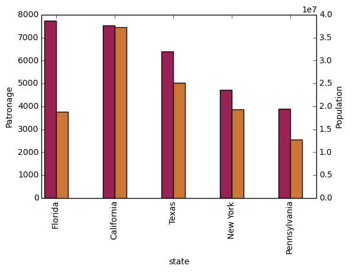

Denver, as a region, is also especially large. Despite having a
population of 650,000 people (and a metropolitcan area of 3 million),
Denver sees a patronage of 1187.
By comparison, the "new york city" region, which is expansive enough
as to include metropolitan area subregions like "new jersey", "long island",
"fairfield", etc, has fewer posts, at 1006.

    1006 posts in NYC spread over:
    manhattan,
    brooklyn,
    queens,
    bronx,
    staten island,
    new jersey,
    long island,
    westchester,
    and fairfield.
    
    This is ~6.5% the usage rate of Denver

This is a remarkably popular region, clearly. I suspect that it has to
do with the state granularity CL most likely arbitrarily assigned
to the Colorado. They might want to consider providing mode regions to
the state of Colorado.

### District of Columbia

While I found Colorado to be an inexplicable anamoly, it was also
justifiably accurate. District of Columbia, having a Republican voting
rate of ~4% and the usage similar to that of Colorado, coupled with
it's unclear geographic distinction and population, meant its results
were too extreme and variable to consider in analysis. Besides, it's
not even a real state&#x2026;

## Patronage

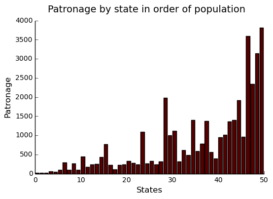

We can get a feel for the usage distribution by taking a look at the
following sample from the `state_usage` table:

<table border="2" cellspacing="0" cellpadding="6" rules="all" frame="all">

<colgroup>
<col  class="org-left" />

<col  class="org-right" />

<col  class="org-right" />

<col  class="org-right" />
</colgroup>
<thead>
<tr>
<th scope="col" class="org-left">&#xa0;</th>
<th scope="col" class="org-right">patronage</th>
<th scope="col" class="org-right">population</th>
<th scope="col" class="org-right">usage</th>
</tr>
</thead>

<tbody>
<tr>
<td class="org-left">Colorado</td>
<td class="org-right">1982</td>
<td class="org-right">5029196</td>
<td class="org-right">1.0</td>
</tr>

<tr>
<td class="org-left">Hawaii</td>
<td class="org-right">445</td>
<td class="org-right">1360301</td>
<td class="org-right">0.817</td>
</tr>

<tr>
<td class="org-left">Montana</td>
<td class="org-right">286</td>
<td class="org-right">989415</td>
<td class="org-right">0.713</td>
</tr>

<tr>
<td class="org-left">Oregon</td>
<td class="org-right">1094</td>
<td class="org-right">3831074</td>
<td class="org-right">0.703</td>
</tr>

<tr>
<td class="org-left">Nevada</td>
<td class="org-right">770</td>
<td class="org-right">2700551</td>
<td class="org-right">0.702</td>
</tr>

<tr>
<td class="org-left">**SPACE**</td>
<td class="org-right">------</td>
<td class="org-right">------</td>
<td class="org-right">------</td>
</tr>

<tr>
<td class="org-left">North Dakota</td>
<td class="org-right">19</td>
<td class="org-right">672591</td>
<td class="org-right">0.0</td>
</tr>

<tr>
<td class="org-left">Vermont</td>
<td class="org-right">18</td>
<td class="org-right">625741</td>
<td class="org-right">0.001</td>
</tr>

<tr>
<td class="org-left">Kansas</td>
<td class="org-right">106</td>
<td class="org-right">2853118</td>
<td class="org-right">0.024</td>
</tr>

<tr>
<td class="org-left">Wyoming</td>
<td class="org-right">22</td>
<td class="org-right">563626</td>
<td class="org-right">0.029</td>
</tr>

<tr>
<td class="org-left">New Jersey</td>
<td class="org-right">400</td>
<td class="org-right">8791894</td>
<td class="org-right">0.047</td>
</tr>
</tbody>
</table>

Seemingly some correlation between low population and low usage is
evident from this table. However, the states for which the politics
board is most popular are also fairly small. It may be that the
popularity doesn't relate to state size, directly, but to political
orientation, which itself correlated with state population. I suspect
that political discussion is most charged currently in Democratic
states, where discenting opinion is the that held by the triumphant
party. It may also be that board popularity relation to patronage is
non-linear. This correlation is explored more by some political
investigation. However, first outliers must be determined and possibly
removed from the data.

## Usage

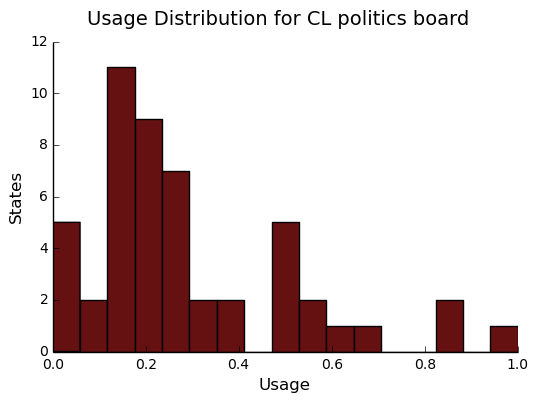

These are the PDF estimations for normalized patronage, population,
usage. They are estimations, so they extend beyond 0 and 1 on the
graph. Usage distribution is the ratio distribution of patronage and
population. 

    min_norm = state_usage - state_usage.min()
    range_norm = state_usage.max() - state_usage.min()
    norm_usage = min_norm / range_norm
    
    norm_usage.plot(kind="density", 
                    title="Normalized PDF estimations",
                    sharey=True)

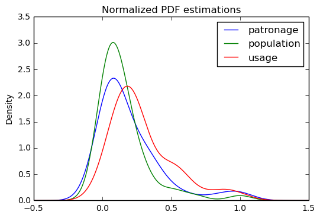

We can see that usage has less variance than patronage and population,
which we should expect. Perhaps it is somewhat more than expected,
however.

Mean/median of normalized state usage metrics:

<table border="2" cellspacing="0" cellpadding="6" rules="all" frame="all">

<colgroup>
<col  class="org-left" />

<col  class="org-right" />

<col  class="org-right" />
</colgroup>
<thead>
<tr>
<th scope="col" class="org-left">&#xa0;</th>
<th scope="col" class="org-right">mean</th>
<th scope="col" class="org-right">median</th>
</tr>
</thead>

<tbody>
<tr>
<td class="org-left">patronage</td>
<td class="org-right">0.197488</td>
<td class="org-right">0.0915567</td>
</tr>

<tr>
<td class="org-left">population</td>
<td class="org-right">0.152608</td>
<td class="org-right">0.105552</td>
</tr>

<tr>
<td class="org-left">usage</td>
<td class="org-right">0.264764</td>
<td class="org-right">0.20374</td>
</tr>
</tbody>
</table>

Here we can see illustrated what's been already hinted at: the states
with the most and least usage are generally less populated and less
patronaged, and, of course, there is a tight correlation between
patronage and population. In the graph, redness relates to usage
positively. The most red and most yellow dots are all in the least
populated states/least patroned boards.

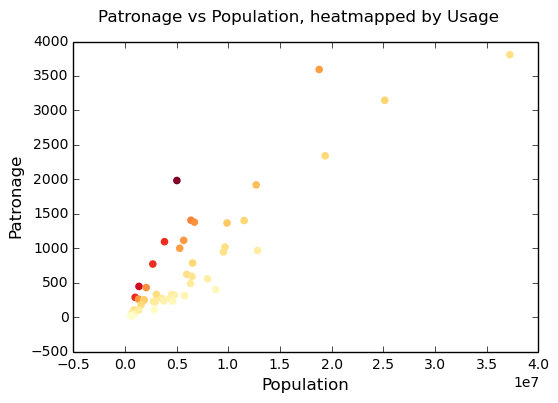

## Politics

It seems that the distribution of posts is weighted on the Democrat's
side of the spectrum:

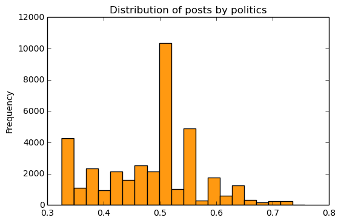

However, Democratic registration outweighs Rebpublican voting rates
slightly. We can visualize this preference a bit differently by
finding the average post trumpism, and comparing it to national voting
trends:

    avg_post_trumpism = post_politics.trumpism.mean()
    trump_votes = voting.sum().trump
    clinton_votes = voting.sum().clinton
    national_trumpism = trump_votes/(trump_votes + clinton_votes)

It's a bit more clear here that the skew of trumpism distribution is
weighted a bit on the left, though the mean is quite close to what's
expected, at about 48% of Trump+Clinton votes. The skewness of
distribution is expected, and in line with my original hypothesis;
more liberal states can expect more discent from the socially charged
Republican minority, while very Trump states have little inspiration
for outcry. In general, it would seem the most divided states see the
most traffic, with less divided having Democratic prominance. The mean
in preserved by what seems to be in states that Trump won by a
relatively small margin.

    Mean trumpism: 48.42 Trump voters seem to show -1.17% representation
    on CL politics vs General Election results.

An alternative representation that may make this skew a bit more apparent:

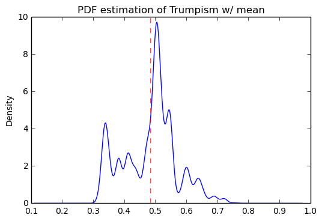

### Usage vs Trumpism

We can see the correlations between patronage, population, and usage,
here. We of course expect correlation between patronage and population
to be quite high: states with more people generally have more
posts. Below, positive correlation is pictured by redness, while
negative is pictures by blueness. Darkness visualizes closeness.

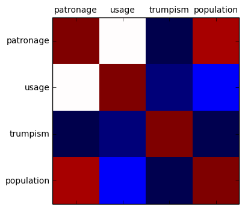

Note the correlation between trumpism and usage. Also, the correlation
between patronage and usage coincides with how you'd expect boards
with the least diversity to be disproportionately unfrequented. Boards
with few posts become ghost towns. Here are the pearson correlation
numbers behinds the colors:

<table border="2" cellspacing="0" cellpadding="6" rules="all" frame="all">

<colgroup>
<col  class="org-left" />

<col  class="org-right" />

<col  class="org-right" />

<col  class="org-right" />

<col  class="org-right" />
</colgroup>
<thead>
<tr>
<th scope="col" class="org-left">&#xa0;</th>
<th scope="col" class="org-right">patronage</th>
<th scope="col" class="org-right">usage</th>
<th scope="col" class="org-right">trumpism</th>
<th scope="col" class="org-right">population</th>
</tr>
</thead>

<tbody>
<tr>
<td class="org-left">patronage</td>
<td class="org-right">1</td>
<td class="org-right">0.336</td>
<td class="org-right">-0.363</td>
<td class="org-right">0.895</td>
</tr>

<tr>
<td class="org-left">usage</td>
<td class="org-right">0.336</td>
<td class="org-right">1</td>
<td class="org-right">-0.302</td>
<td class="org-right">-0.008</td>
</tr>

<tr>
<td class="org-left">trumpism</td>
<td class="org-right">-0.363</td>
<td class="org-right">-0.302</td>
<td class="org-right">1</td>
<td class="org-right">-0.344</td>
</tr>

<tr>
<td class="org-left">population</td>
<td class="org-right">0.895</td>
<td class="org-right">-0.008</td>
<td class="org-right">-0.344</td>
<td class="org-right">1</td>
</tr>
</tbody>
</table>

# Text Qualities

Text usage is interesting to consider, but difficult to evaluate
semantically. While sampling encourages some compelling thoughts about
the data, proving any derivative ideas is a bit difficult. The
following is an effort to support the introduction of this blog post.

Popular English words are excluded from the analysis. Words like
"the", "re", "and", etc., don't contribute interestingly. Popular
words were grabbed from <http://www.world-english.org/english500.htm>,
and a couple were added as needed (e.g., "re" appears all the time).

## Liberals vs Conservatives

Investigating the discrepency between democrat/republican word usage,
we see the some discrepencies in the most used common words. Grab some words

    lib_words = words(df=post_politics[post_politics.trumpism < .45],
                      no_pop=True).rename("libs")
    conserv_words = words(df=post_politics[post_politics.trumpism > .55],
                          no_pop=True).rename("conservs")

<table border="2" cellspacing="0" cellpadding="6" rules="all" frame="all">

<colgroup>
<col  class="org-left" />

<col  class="org-right" />

<col  class="org-right" />
</colgroup>
<thead>
<tr>
<th scope="col" class="org-left">&#xa0;</th>
<th scope="col" class="org-right">counts</th>
<th scope="col" class="org-right">dem/rep ratio</th>
</tr>
</thead>

<tbody>
<tr>
<td class="org-left">thought</td>
<td class="org-right">393</td>
<td class="org-right">22.27</td>
</tr>

<tr>
<td class="org-left">2017</td>
<td class="org-right">230</td>
<td class="org-right">9</td>
</tr>

<tr>
<td class="org-left">must</td>
<td class="org-right">142</td>
<td class="org-right">8</td>
</tr>

<tr>
<td class="org-left">11</td>
<td class="org-right">128</td>
<td class="org-right">7.45</td>
</tr>

<tr>
<td class="org-left">usa</td>
<td class="org-right">276</td>
<td class="org-right">6.81</td>
</tr>
</tbody>
</table>

We find that "against", "how", and "won" have extreme preference for
"liberal" states. The reasons are in fact not obvious. Some random
sampling of such posts reveals possibly surprisingly pro-Trump
sentiment:

<table border="2" cellspacing="0" cellpadding="6" rules="all" frame="all">

<colgroup>
<col  class="org-right" />

<col  class="org-left" />
</colgroup>
<thead>
<tr>
<th scope="col" class="org-right">&#xa0;</th>
<th scope="col" class="org-left">title</th>
</tr>
</thead>

<tbody>
<tr>
<td class="org-right">29440</td>
<td class="org-left">George Lopez said he would leave USA if Trump won!</td>
</tr>

<tr>
<td class="org-right">28220</td>
<td class="org-left">Thought for the Day</td>
</tr>

<tr>
<td class="org-right">1427</td>
<td class="org-left">TRUMP PICKS GOLDMAN SACHS PRES GARY COHN TO DESTROY USA ECONOMY AGAIN</td>
</tr>

<tr>
<td class="org-right">28806</td>
<td class="org-left">CHER said she would move to jupiter if TRUMP won!</td>
</tr>

<tr>
<td class="org-right">28149</td>
<td class="org-left">Thought for the Day</td>
</tr>
</tbody>
</table>

Looking at the general word sentiment, we see clearly that
disproportionately Trump and Obama are discussed. Note that "hillary"
and "clinton" are surprisingly not mentioned as much as you might
think. "Clinton", in fact, is mentioned less freqeuntly than
"Donald". It may be that a month after the election, "hillary" talk
has already begun to significantly subside. It's impossible to know
for sure, as CL does not hold on to their posts for longer than a
week.

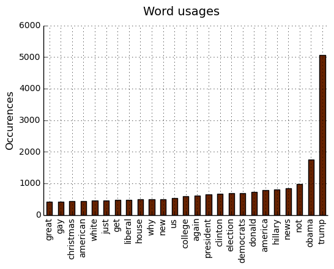

### Unicode

I was curious about non-ascii usage, and so I used to following code
to catch them.

    def check_ascii(post):
        """
        Determines whether a title is encodable as ascii
        """
        try:
            post.encode('ascii')
            return True
        except UnicodeError:
            return False
    
    ascii_posts = usa[usa.title.apply(check_ascii)]
    nonascii_posts = usa[~usa.title.apply(check_ascii)]
    distinct_states = nonascii_posts["state"].unique()

The number of posts containing non-ascii characters was surprisingly small:

    219 of 38,324 total posts were non-ascii (0.57%), confined to 22 states.

However, influence for these posts can be seen by looking at the main
outlier, Pennsylvania:

    pennsylvania = nonascii_posts[nonascii_posts["state"] == "Pennsylvania"]
    pennsylvania.groupby("region").count()
    penn_lenn = float(len(pennsylvania.title))
    
    post_uniqueness = (penn_lenn-pennsylvania.title.nunique())/penn_lenn * 100

We can use a SequenceMatcher to test the similarity of the strings in
the pool:

    import itertools
    from difflib import SequenceMatcher
    
    def avg_similarity(posts):
      def similarity(a, b):
        return SequenceMatcher(None, a, b).ratio()
    
      sim_sum = 0
      title_product = itertools.product(posts.title, posts.title)
      for title_pair in title_product:
        sim_sum += similarity(*title_pair)
    
      avg_sim = sim_sum/(len(posts)**2)
      return avg_sim

We then can run this over all non-ascii posts to get an idea of how
much silliness is going on with these posts:

    The average similarity of all non-ascii posts is 0.19, while that 
    of only those in Pennsylvania is 0.38. The average for all posts in
    all regions is 0.20.

It would therefore seem that a single Trump memester, making use of a
handful of unicode symbols, is responsible for this chaos in
Pennsylvania. I suspect that these crazy unicode posts are mostly
done by a very small set of people in general, though there is no
good way to tell, as CL remains completely anonymous.

### "trumps"

The more pro-Trump your state, the less likely you are to use "TRUMP"
over "Trump". Below is a visual depicting this ratio, by states in
order of trumpism. We can see that states on the right of the graph
tend to have a low ratio of upper to proper. It isn't too surprising,
as you expect, in leiu of social resistance, for pro-Trump regions to
settle for respectful praise over excitement and hysteria, a general
tone which is supported by some cursory sampling of these regions.

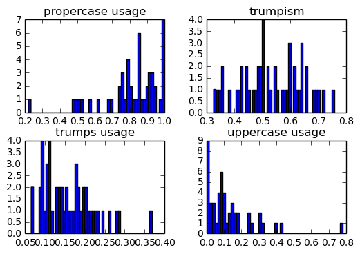

Looking at the distribution of "trump" posts across trumpism looks
much the same as the distribution of all posts across trumpism:

However, Democratic states seem to have relatively strong preferance
for using "TRUMP" versus "Trump". Below's graph depicts this skew,
which is made more noticible by the considerable left-shift of the
mean:

It isn't clear why there seems to be preference for capitalization of
"TRUMP" among Dem states; are they mostly angry and disparaging,
supportive, or a bit of both? Some random sampling of particularly
liberal states might provide some clues:

    liberal_sample = trumps_trumpism[trumps_trumpism.trumpism < .45].sample(5)

Selecting states that are espectially anti-trump:

<table border="2" cellspacing="0" cellpadding="6" rules="all" frame="all">

<colgroup>
<col  class="org-right" />

<col  class="org-left" />
</colgroup>
<thead>
<tr>
<th scope="col" class="org-right">&#xa0;</th>
<th scope="col" class="org-left">**trump**</th>
</tr>
</thead>

<tbody>
<tr>
<td class="org-right">12168</td>
<td class="org-left">Trump voters, voting against their own interest perhaps?</td>
</tr>

<tr>
<td class="org-right">11770</td>
<td class="org-left">Holding anti-Trump sign at 3PM, 11/19, SLO Courthouse</td>
</tr>

<tr>
<td class="org-right">28633</td>
<td class="org-left">These folks said they would move out if TRUMP WON!</td>
</tr>

<tr>
<td class="org-right">2258</td>
<td class="org-left">lesbian bitch got trumped fuck you ho's</td>
</tr>

<tr>
<td class="org-right">14127</td>
<td class="org-left">trump and clinton agree on this</td>
</tr>
</tbody>
</table>

Politically liberal states composing the above sampling:
Californiah, New Yorkh, Illinoish.

### "liberals" vs "conservatives"

-   **Usage**

    "liberal" is used far more often than "conservative". The
    pluralizations, respectively, are comparitively not quite as
    distinguished. This is expected, for previously mentioned reasons;
    pluralizations may still be used as a means to negatively generalize.
    
        liberal/conservative: 18.07
        liberals/conservatives: 5.16
        liberal(s)/conservative(s): 10.14

-   **Pluralization**

    The singular version of "conservative" is used a bit more than half as
    much as the pluralization. By contrast, the singular version of
    "liberal" is used more than twice as much as the pluralization. I
    suspect this is because "liberal" is a perjorative in common
    nomenclature, while "conservative" doesn't really hold the same weight
    as an insult:
    
        *singular/plural*
        'conservative': 0.628
        'liberal': 2.198

-   **Capitalization**

    We here see that, among democrats, "liberal" is capitalized at a rate
    13x greater than the rate of capitalization of "conservative". We also
    see that lowecase usage preference is completely neglible.
    
        lib_cap = eval_strs("trump").sum(numeric_only=True)
        conserv_cap = eval_strs("liberal").sum(numeric_only=True)
        
        lib_con_cap_rat = (lib_cap/conserv_cap).rename(
            "Dem/Rep capital rates for 'trump'")
    
    <table border="2" cellspacing="0" cellpadding="6" rules="all" frame="all">
    
    
    <colgroup>
    <col  class="org-left" />
    
    <col  class="org-right" />
    </colgroup>
    <thead>
    <tr>
    <th scope="col" class="org-left">&#xa0;</th>
    <th scope="col" class="org-right">Dem/Rep capital rates for 'trump'</th>
    </tr>
    </thead>
    
    <tbody>
    <tr>
    <td class="org-left">proper</td>
    <td class="org-right">10.5951</td>
    </tr>
    
    
    <tr>
    <td class="org-left">uppercase</td>
    <td class="org-right">13.4286</td>
    </tr>
    
    
    <tr>
    <td class="org-left">lower</td>
    <td class="org-right">1.07721</td>
    </tr>
    </tbody>
    </table>

### Semantics

I figured that a natural way to go about proving my hypothesis
outlined in this blog's introduction would be semantic analysis. I
quickly decided that this was, with it's present implementation, at
least, not the way to go about it. The following code will run
semantic analysis using the popular NLTK package. The results are
dubious.

    from textblob import TextBlob
    
    def semants(text):
        blob = TextBlob(text)
        ss = 0
        for sentence in blob.sentences:
            ss += sentence.sentiment.polarity
        return float(ss)/len(blob.sentences)
    
    # package does not like non-ascii encodings
    trumps_ascii = trumps[trumps["*trump*"].apply(check_ascii)]
    
    
    usa_sentiment = post_politics.join(ascii_posts.title.apply(
        semants).rename("sentiment"))
    trumps_sentiment = usa_sentiment.filter(trumps_ascii.index, axis=0)

However, the results, and general output of the semantic analyzer,
were quite unconvincing, even if only interpreted as a binary measure:

    zero_sents = len(usa_sentiment[usa_sentiment.sentiment == 0])
    print(('Number of posts with 0 sentiment: {0:,} ' + 
           '({1:.2f}%).').format(zero_sents, 
                                 float(zero_sents)/len(usa_sentiment)*100))

    Number of posts with 0 sentiment: 25,632 (66.88%).

# Conclusion

The distribution posts and the favor of those posts across the
politics sections is somewhat surprising. I suspect that this is
evidence of cultural normalization in the face of
resistance+anonimity: faceless, nameless interaction coupled with
outspokenness against relatively strict local social norms. This has
proven more difficult to prove than I initially suspected. While any
amount of ransom sampling of the posts allows me to be confident in
this theory, convincing proof would most likely involve a tedious,
exhausive effort.

# Notes about this document

This document is, in its original form, an emacs org-mode
organizational markup document that supports interactive programming
and exporting quite thoroughly. It exports to a variety of formats
(html, latex, markdown, etc), and in this case, was exported directly
to html. It's quite powerful, and allows me to tailor what headers are
exported, what code is exported, what code results, to what
interpreter the code talks, how it's formated, etc. The original
document, if viewed in org-mode in emacs, is quite a bit larger,
containing all of the code used for the project, most of which is not
shown in markdown exports. Therefore, if you view this document on
github, you will see a truncated version much like the version you are
likely viewing now. You can view on github, a .ipynb and a .py export
are available for the complete code of the document. Obviously, they
won't include the organization and commentary. You can look at the raw
contents of the .org file if curious (github will export primitively
to html by default for display), or check out this [blog on interactive
python programming in emacs org-mode](http://kozikow.com/2016/05/21/very-powerful-data-analysis-environment-org-mode-with-ob-ipython/comment-page-1/#comment-240).

